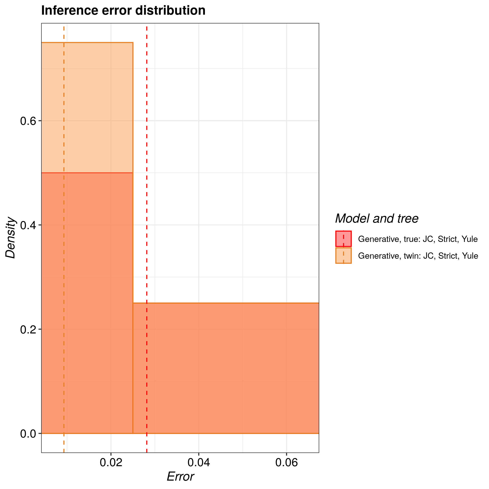
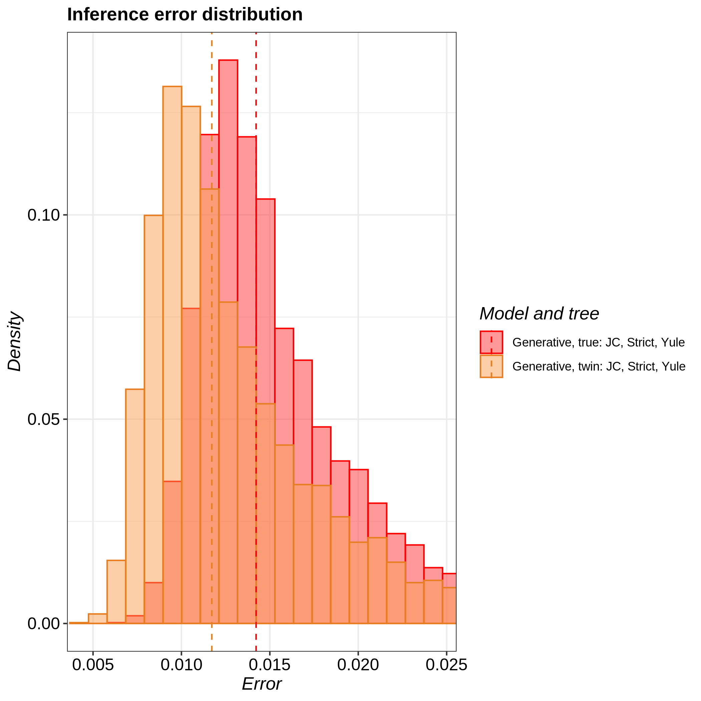
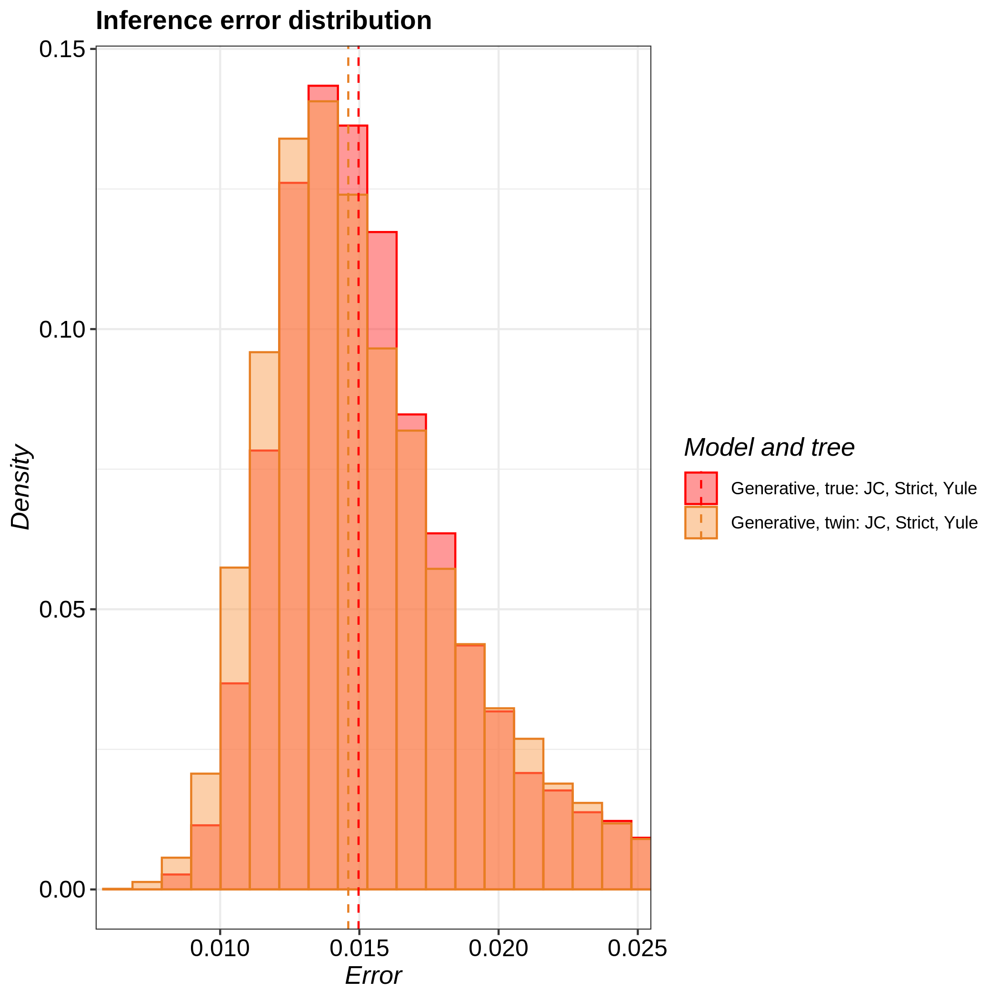
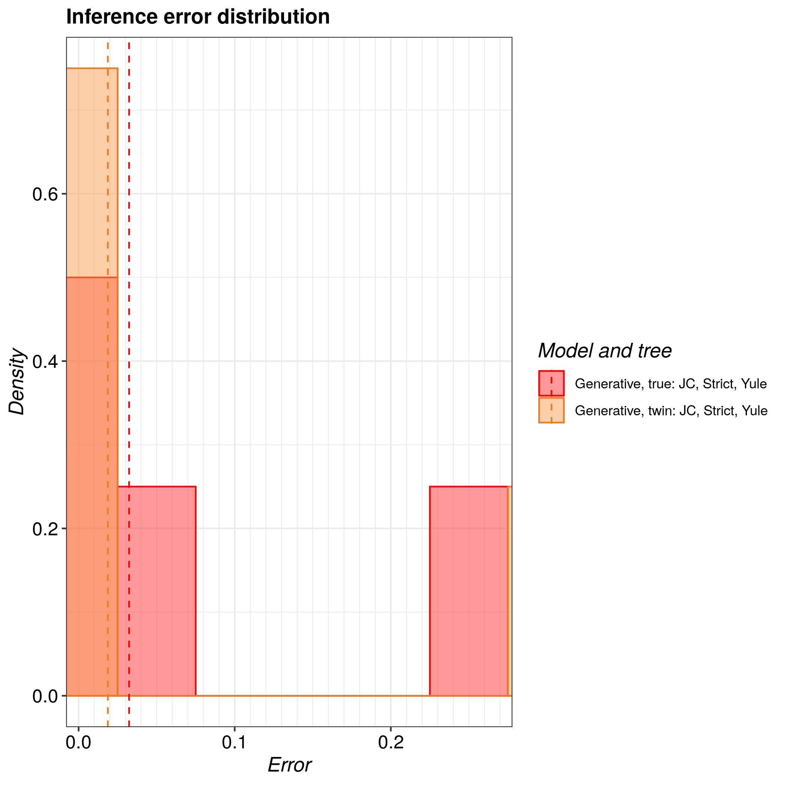

# pirouette_example_23

Branch   |                                                                                                 |                                                                                               
---------|--------------------------------------------------------------------------------------------------------------------------------------------------------------|--------------------------------------------------------------------------------------------------------------------------------------------------------------------------------------------
`master` | |?
`develop`||?

A [pirouette example](https://github.com/richelbilderbeek/pirouette_examples) that shows the true and twin errors for DD trees of different likelihoods, using a BD tree prior

## Results

Lowest likelihood:

Between lowest and median likelihood:

Median likelihood:

Between median and highest likelihood:

Highest likelihood:

