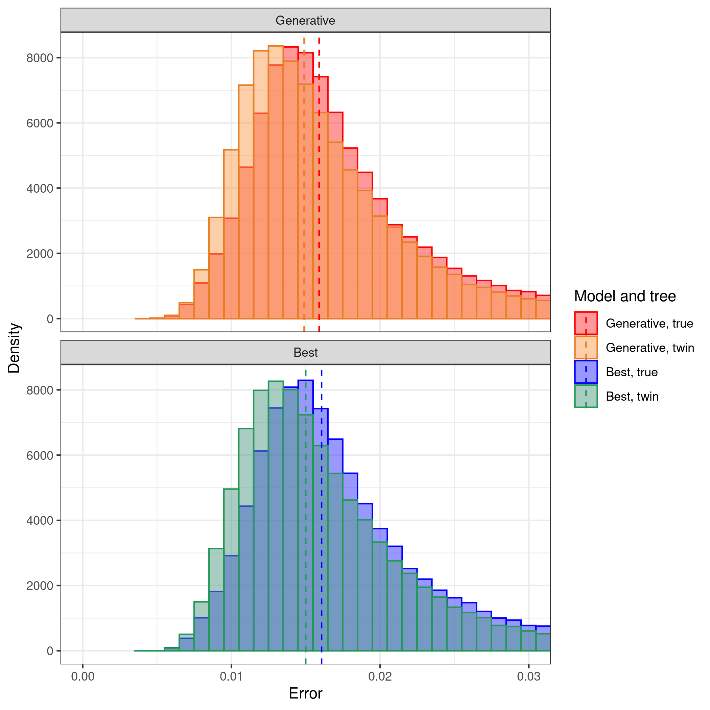
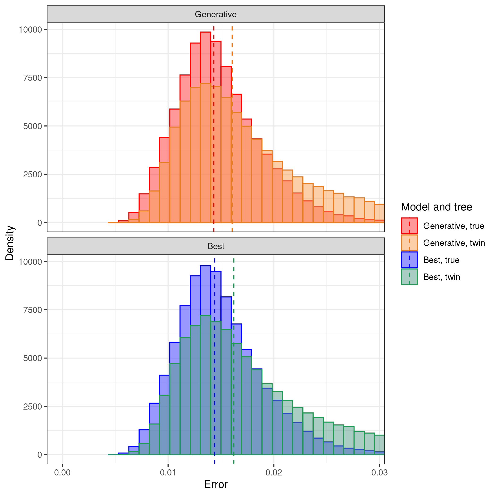
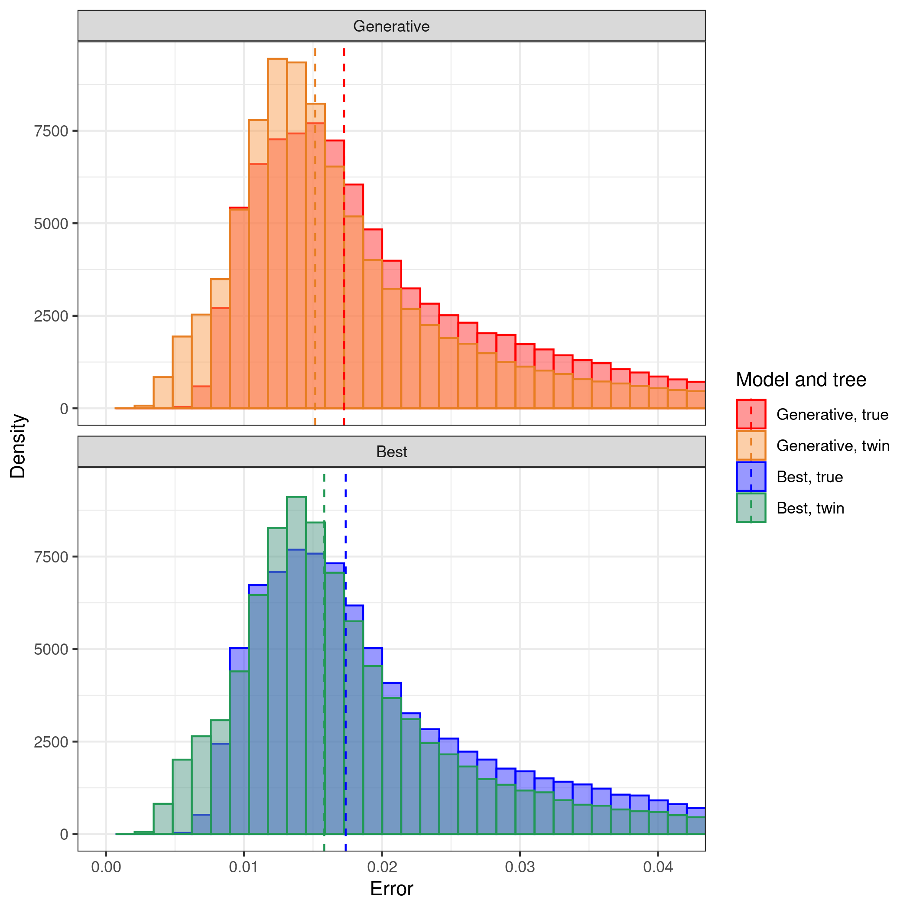
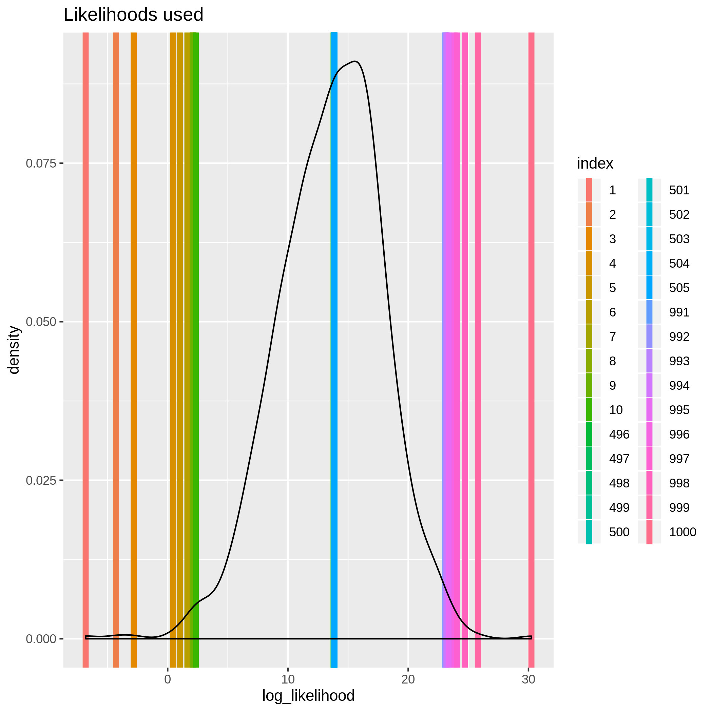

# pirouette_example_23

Branch   |                                                                                                 |                                                                                               
---------|--------------------------------------------------------------------------------------------------------------------------------------------------------------|--------------------------------------------------------------------------------------------------------------------------------------------------------------------------------------------
`master` | |
`develop`||

A [pirouette example](https://github.com/richelbilderbeek/pirouette_examples) that shows the true and twin errors for DD trees of different likelihoods, using a BD tree prior

## Results

 * Download the intermediate data at 
   [https://www.richelbilderbeek.nl/pirouette_example_23.zip](https://www.richelbilderbeek.nl/pirouette_example_23.zip)

